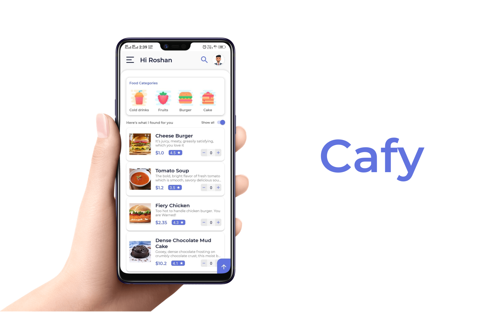

# CafyTheOfficeCafeteria

Smooth & fast order...

### How to run this project in Android Studio?  
1. First import this project in android studio   
2. Open Firebase and create a project (name it anything, like - Cafeteria Project)  
3. If you face any issue, just watch some videos on YouTube  
4. At some point you will get an option to download google-services.json (just download it)  
5. Switch your Android view to Project view in Android Studio  
6. Just paste the google-services.json in app directory  
7. Enable Email Authentication in created Firebase Project 
8. Enable the Realtime Database  
9. Enable the Storage  
10. Just Run the project !!!

(NOTE:: Before running, make sure that you have added some items in food_menu and the canteen_info. I have provided "cafy---the-office-cafeteria-default-rtdb-export.json" file in which data is shown in json format, you can import this file to your Realtime Database. Also Add the images in Firebase Storage, and update the item_image_url in database, otherwise your App will crash)

### Format of Database

### Features  
1. Offline Menu Support  
2. Choose weather to load images or not  
3. Show QR Code to canteen, without giving any details  
4. Track your order history  
5. View bill on every order  
6. Search easily  

### How to use App?  
1. Open App  
2. Go to Register Screen  
3. Fill all the details  
4. Upload your Employee ID Card  
5. Click Preview to view all the filled details  
6. Click on Register  
7. Verification Link will sent to provided email id  
8. Verify it  
9. Login with Registered email address & password  
10. Click on Forgot Password, if you don't remember the password  
11. For first time, it will ask for your gender. Choose your gender  
12. Enjoy !  

### How to make an Order?  
1. Add items by increasing their quantity  
2. Choose from above category to find same related items  
3. You can also search items  
4. When items are added, press on Up arrow to show total price and items  
5. Click on Place Order  
5. Review your order (Change or update items)  
6. Set Take-away time for your order  
7. View the total price, total tax, sub-total of your order  
8. Click on Proceed to Pay button  
9. Make a payment from many available payment methods (Cash, Wallets, Saved Cards, Credit/Debit Card, Bhim Upi)  
10. Order Successful

(You can then see the order in "My Orders")

When you will reach to canteen to take away your order, just show the QR Code of that order to the staff. They will just scan it and will not ask any details from you.
Enjoy your meal !!!

## Watch Demo
https://youtu.be/_nO0KRIcJdw
