# CafyTheOfficeCafeteria

Smooth & fast order...


### How to run this project in Android Studio?  
1. First import this project in android studio (Download this project)    
2. Open Firebase Console and create a project (name it anything, like - Cafeteria Project)  
3. If you face any issue, just watch some videos on YouTube or see this post (https://firebase.google.com/docs/android/setup)  
4. At some point you will get an option to download "google-services.json" (just download it)  
5. Switch your Android view to Project view in Android Studio  
6. Just paste the "google-services.json" in "app" directory  
7. Enable "Email Authentication" in created Firebase Project 
8. Enable the "Realtime Database" and "Storage" in your firebase project  
9. Update the Storage rules, ```allow read, write: if true;```  
10. Create folder "foodMenuItems" and upload your menuItem images, and add the url link in realtime database.    
11. Just Run the project !!!

(NOTE:: Before running, make sure that you have added some items in food_menu and the canteen_info. I have provided "cafy---the-office-cafeteria-default-rtdb-export.json" file in which data is shown in json format, you can import this file to your Realtime Database. Also Add the images in Firebase Storage, and update the item_image_url in database, otherwise your App will crash)

### Format of Database
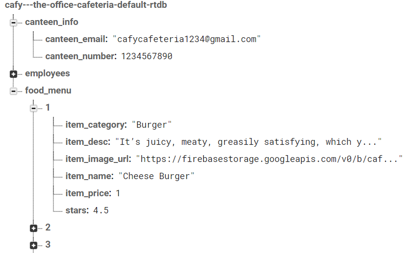

### Features  
1. Offline Menu Support  
2. Choose weather to load images or not  
3. Show QR Code to canteen, without giving any details  
4. Track your order history  
5. View bill on every order  
6. Search easily  

### How to use App?  
1. Open App  
2. Go to Register Screen  
3. Fill all the details  
4. Upload your Employee ID Card  
5. Click Preview to view all the filled details  
6. Click on Register  
7. Verification Link will sent to provided email id  
8. Verify it  
9. Login with Registered email address & password  
10. Click on Forgot Password, if you don't remember the password  
11. For first time, it will ask for your gender. Choose your gender  
12. Enjoy !  

### Some Snapshots of this App  
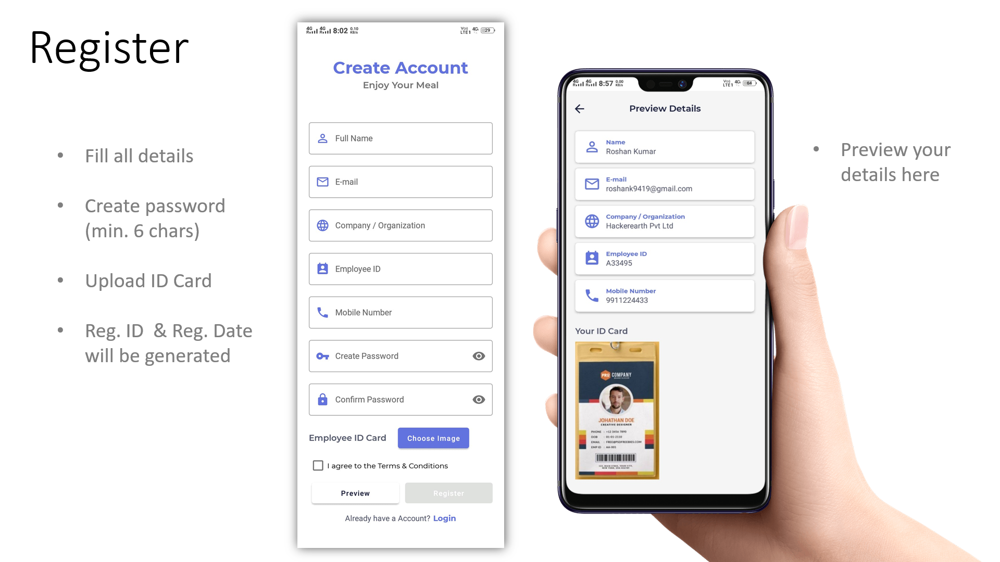
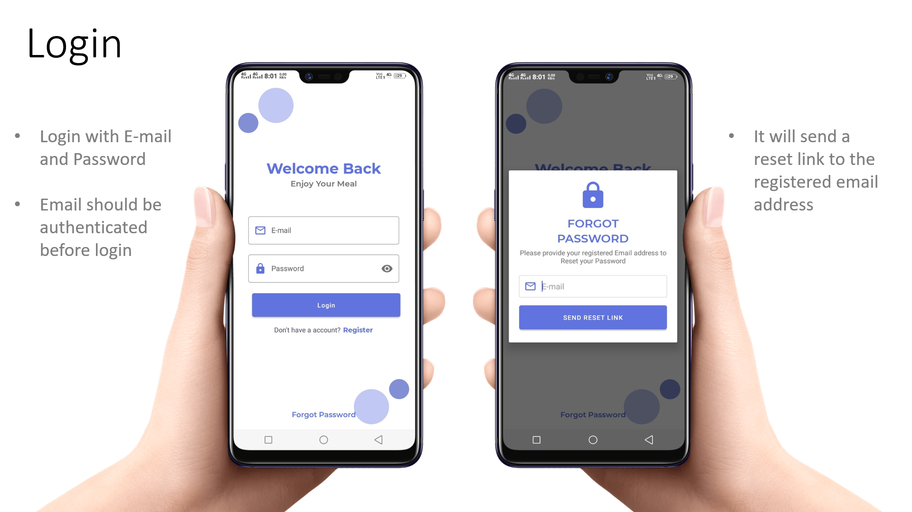
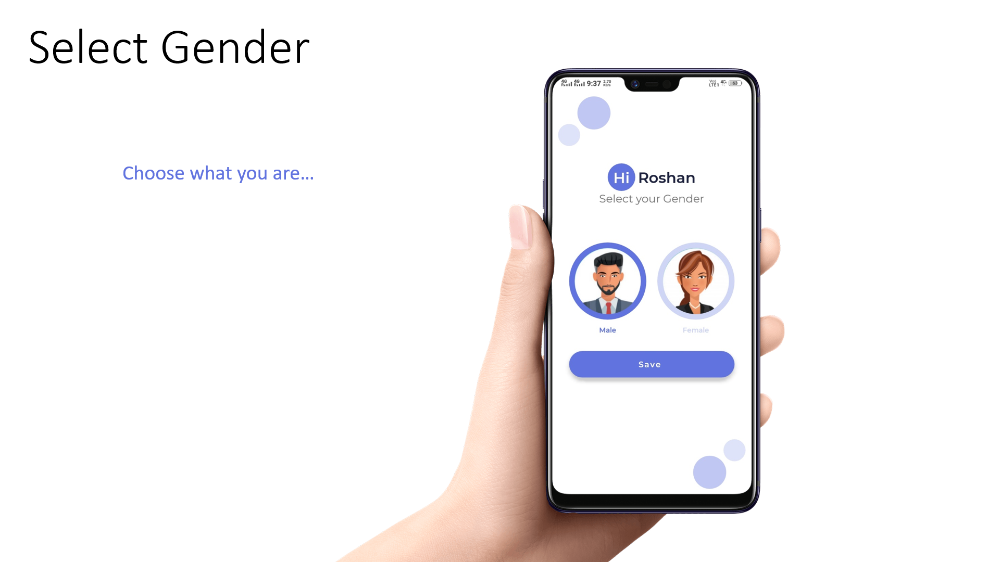
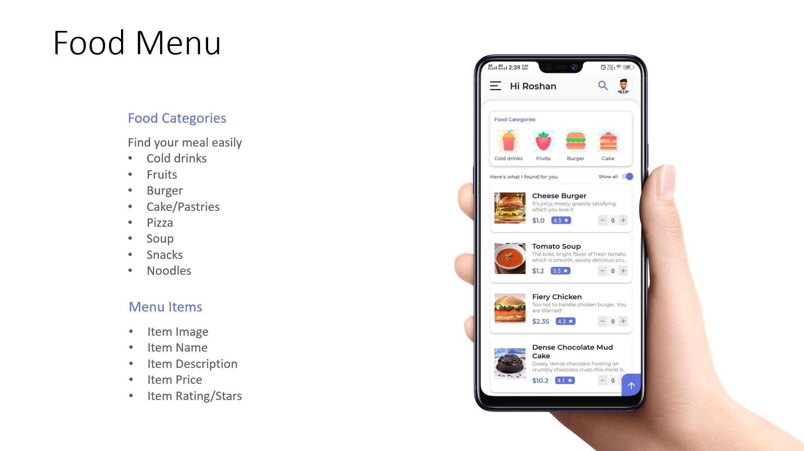
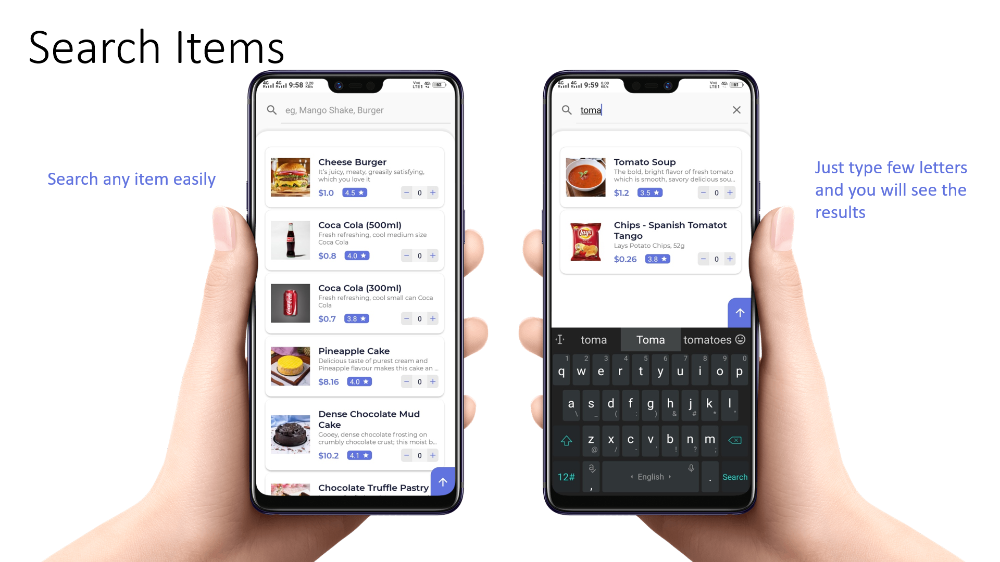
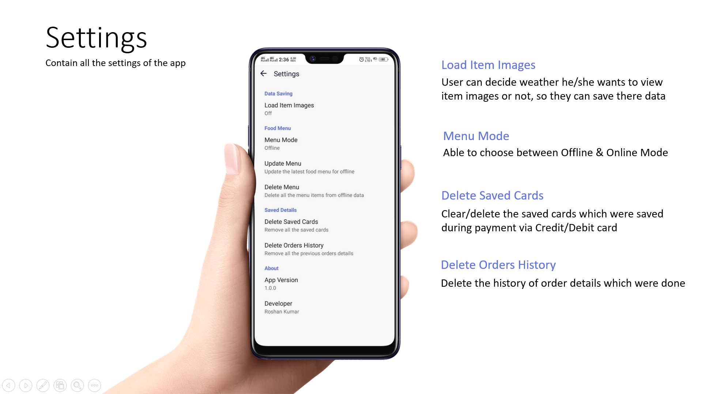
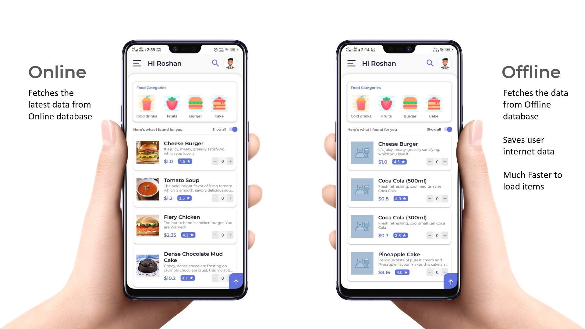
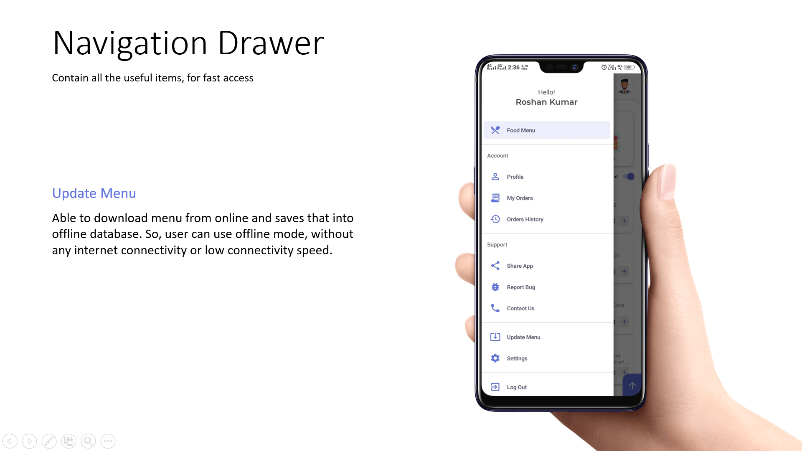
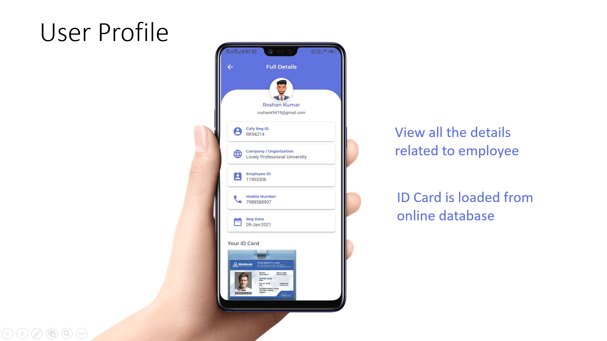
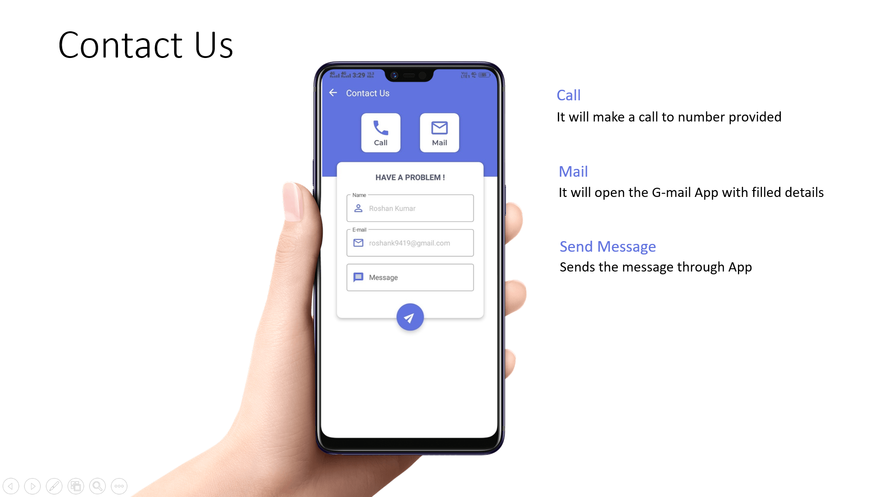
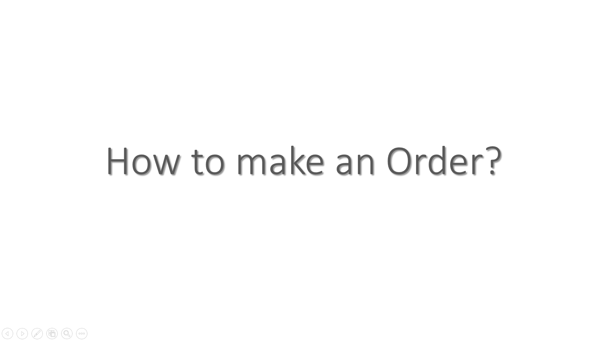
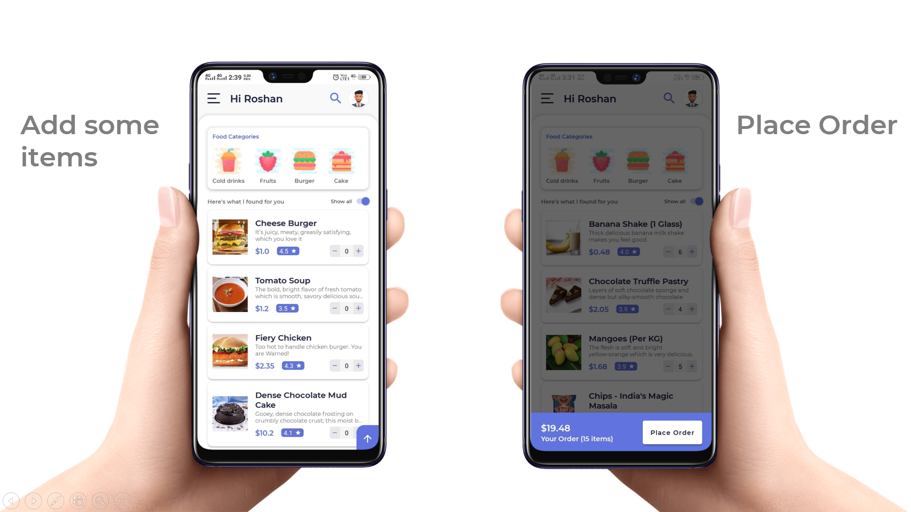
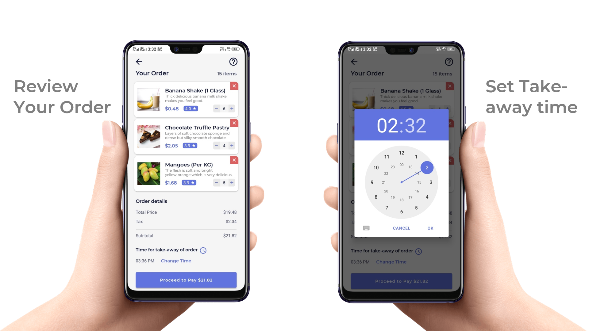
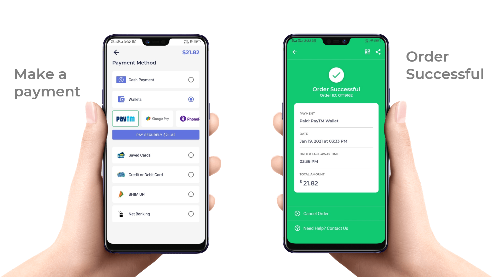
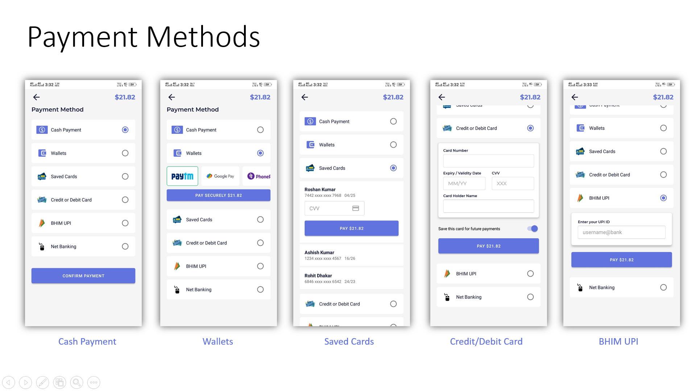
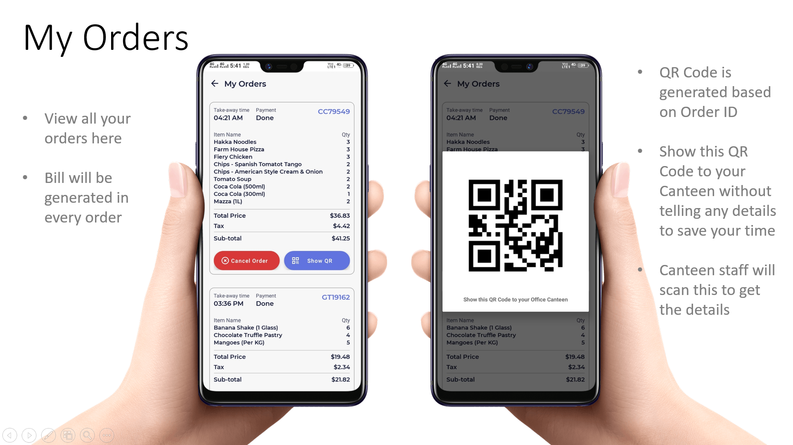
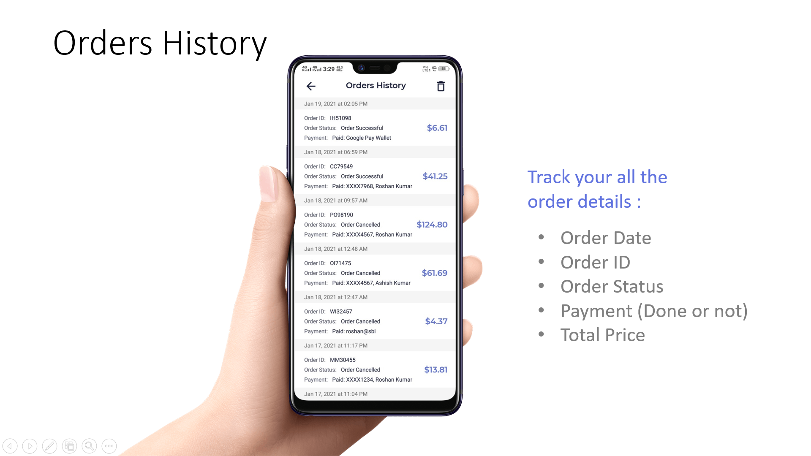

## Watch Demo
https://youtu.be/_nO0KRIcJdw
